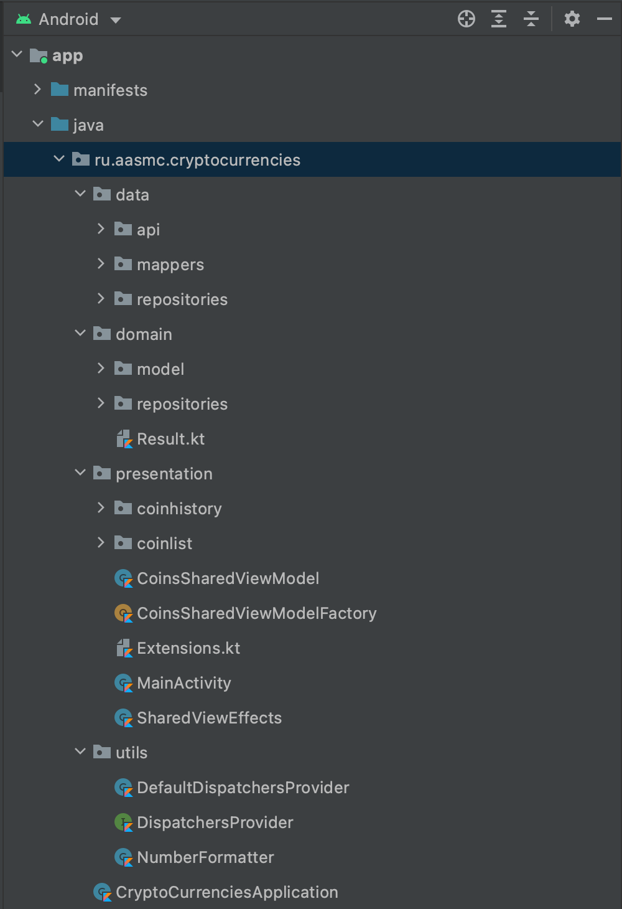

# Crypto Currencies 

Educational app that shows a list of cryptocurrencies. Allows the user to click on each to display a chart
of its price variation in the last 24h.

## Architecture

The project follows a Clean Architecture approach and MVVM pattern.



## Charts

The Project uses MPAndroidChart library to display the coin history.

```text
https://github.com/PhilJay/MPAndroidChart
```

### API

The coins data is retrieved from https://docs.coincap.io/#ee30bea9-bb6b-469d-958a-d3e35d442d7a

```
Copyright (c) 2021 Razeware LLC

Permission is hereby granted, free of charge, to any person obtaining a copy
of this software and associated documentation files (the "Software"), to deal
in the Software without restriction, including without limitation the rights
to use, copy, modify, merge, publish, distribute, sublicense, and/or sell
copies of the Software, and to permit persons to whom the Software is
furnished to do so, subject to the following conditions:

The above copyright notice and this permission notice shall be included in
all copies or substantial portions of the Software.

Notwithstanding the foregoing, you may not use, copy, modify, merge, publish,
distribute, sublicense, create a derivative work, and/or sell copies of the
Software in any work that is designed, intended, or marketed for pedagogical or
instructional purposes related to programming, coding, application development,
or information technology.  Permission for such use, copying, modification,
merger, publication, distribution, sublicensing, creation of derivative works,
or sale is expressly withheld.

This project and source code may use libraries or frameworks that are
released under various Open-Source licenses. Use of those libraries and
frameworks are governed by their own individual licenses.

THE SOFTWARE IS PROVIDED "AS IS", WITHOUT WARRANTY OF ANY KIND, EXPRESS OR
IMPLIED, INCLUDING BUT NOT LIMITED TO THE WARRANTIES OF MERCHANTABILITY,
FITNESS FOR A PARTICULAR PURPOSE AND NONINFRINGEMENT. IN NO EVENT SHALL THE
AUTHORS OR COPYRIGHT HOLDERS BE LIABLE FOR ANY CLAIM, DAMAGES OR OTHER
LIABILITY, WHETHER IN AN ACTION OF CONTRACT, TORT OR OTHERWISE, ARISING FROM,
OUT OF OR IN CONNECTION WITH THE SOFTWARE OR THE USE OR OTHER DEALINGS IN
THE SOFTWARE.
```